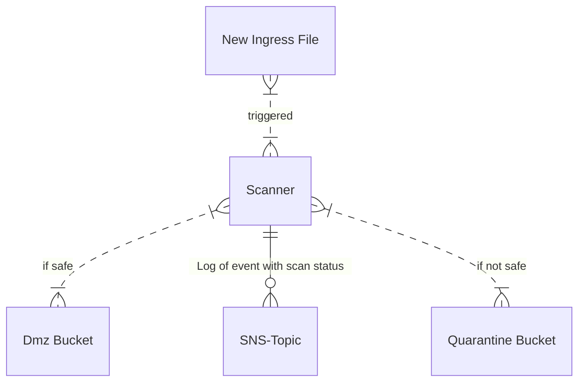

# S3 Ingress with scanning

An Ingress bucket where objects can be uploaded and then scanned. Once the object is found safe, it is moved to a DMZ bucket. If not safe, they are placed in a Quarantine bucket.



# FAQ

**How often does the antivirus update?** By default, once a day. There is a parameter that sets the cadence, so run as often as you want.

**How can I know if a file is in quarantine?** You can subscribe to the SNS Topic with an attribute filter of `status: failed`.

**How can I feed my events to a log management system such as Splunk or EKS?** Subscribe the log ingestion to the SNS Topic.

**How can I control who has access to the quarantined objects?** There is a parameter for the `Quarantine Admins`.

**How can I trigger application ingestion of new objects?** If you feed data for ingestion to an application, subscribe to the SNS Topic with an attribute filter of `status: pass` will let you know when a new object is available.

**How long does the object remain available in the buckets?** The `DMZ Bucket` and `Quarantine Bucket` keep the objects for seven days. The ingress bucket also keeps the objects for seven days, but post-scanning, a delete marker is placed.

**HWhy can I put objects in the ingress bucket but not download from the ingress bucket?** The ingress bucket receives objects. To access them, use the DMZ bucket post-scanning.

**How do I allow others to upload to the ingress bucket?** Add them to the parameter for IngressPriciples

**What is the maximum file size that can be scanned?** Today, the maximum file size for scanning is 10G. This can be increased by using efs for the storage while scanning. If you want this functionality, please raise a GitHub issue.

## Setup / Install

**Step 1:** Create a artifact bucket using the cloudformation template `templates/artifact-buckets.yaml`.

**Step 2:** Create a zip file for the build artifact, then copy it to the bucket.
```
zip -r file.zip \
  templates/cloudformation.yaml \
  handlers/pyclam.py \
  scripts/build.sh \
  Dockerfile \
  buildspec.yaml
aws s3 cp file.zip s3://$BUCKET/
```

**Step 3:** Deploy the Pipeline stack from the template `templates/pipeline.yaml`, setting the parameters for the ArtifactBucket and ArtifactKey to be the bucket and file uploaded from step 2.
